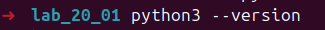
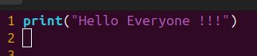
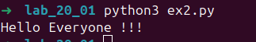

# Personal Info:

    Student Name :  Lavish Goyal
    SAP ID       :  590022914
    Batch        :  B-17
    Course       :  B.Tech(AI & ML)
    Subject      :  Python Programming

# Experiment-1: Python Installation and starting with python.

## Aim
    To understand Python installation and write basic Python programs using print statements, variables, and data types..

## Program Code

## Output

# Experiment-2: Python programs to print strings in the given manner

## Aim
    To learn basic print statement

## Program code
* 
* 
* 
* 

## Output
* 
* 
* 
* 

# Experiment-3: Declare a string variable x and print its value.

## Aim
    To declare a sting variable x and print its value

## Program Code

## Output

# Experiment-4: Take different data types and print values

## Aim
    To learn about different data types and print value.

## Program Code

## Output

# Experiment-5: Print full anem by adding first name and last name

## Aim
    To learn concatenation with example.

## Program Code

## Output

# Experiment-6: Print name with nickname in parenthesis

## Aim
    To print name with parenthesis

## Program Code

## Output

# Experiment-7: Print personal details in specified format.

## Aim
    To print persoanl details.

## Program Code

## Output
